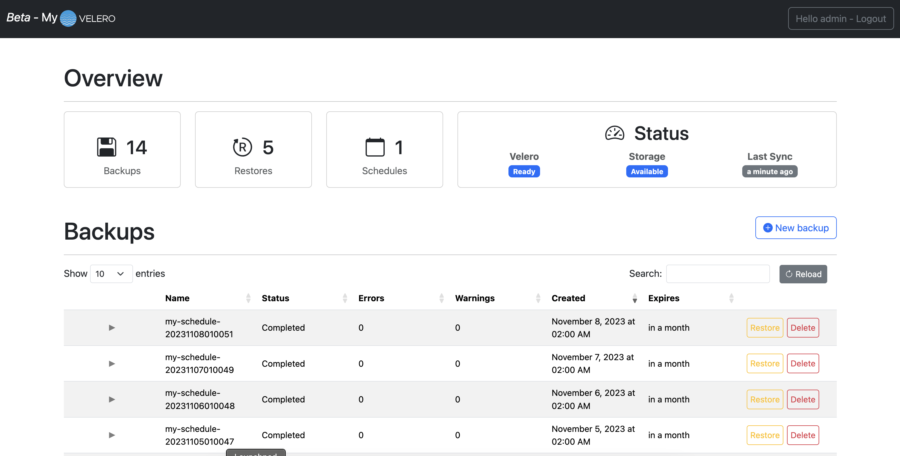

# My Velero Dashboard

This is a very simplified Velero dashboard for backup, restore and schedule management inside a K8S cluster.

[](https://dl.circleci.com/status-badge/redirect/gh/mmohamed/velero-dashboard/tree/dev)
[](https://snyk.io/test/github/mmohamed/velero-dashboard)



---

## Features

### 1. User features

- Get Velero instance status
- Create new backup job from scratch
- Create new backup job from schedule
- Delete a backup
- Create new restore job from a backup
- Create new schedule
- Delete a schedule
- Pause / Unpause a schedule
- Get backup and restore result information (logs included)
- Full Rest API support (docs /v1/docs)

### 2. App features

- Read only mode: if enabled, users (admin not included), can only get/see information about backup, restore and schedule without performing changes.

```ini
READ_ONLY_USER=true #default false
```

- LDAP authentication for users : if a LDAP is configured, users (in addition to the admin and OIDC users) can be authenticated and have access to the dashboard

```ini
LDAP_HOST=ldaps://0.0.0.0:636
LDAP_SKIP_SSL=1
LDAP_START_TLS=0
LDAP_BIND_DN="CN=admin,OU=users,DC=mtr,DC=com"
LDAP_BIND_PASSWORD=<some-ldpa-dami-password>
LDAP_SEARCH_BASE="OU=users,DC=mtr,DC=com"
LDAP_SEARCH_FILTER=sAMAccountName
```

- OIDC authentication : if an OIDC is configured, users (in addition to the admin and LDAP users) can be authenticated and have access to the dashboard.

```ini
# See example config file ; beside extraScopes, userClaim and groupClaim, other parameters are required.
OIDC_CONFIG_PATH=/absolut/path/config/dir #default null
# Set up OIDC SSL server
NODE_EXTRA_CA_CERTS=/absolut/path/cert/file
```
```json
{
    "clientId": "authorization-code-client-id",
    "clientSecret": "authorization-code-client-secret",
    "discoveryUrl": "https://172.20.96.1:31246",
    "redirectUrl": "http://localhost:3000/auth/oidc/callback",
    "baseUrl": "http://localhost:3000",
    "extraScopes": ["groups"],
    "userClaim": "name",
    "groupClaim": "groups"
}
```

- Multi-tenant & User access namespaced scope : With LDAP configuration, you can define a scope control based on an assotioation of a LDAP groups or OIDC groups and a list of namespace, for example, if a user X is member of group group-it, he can manage backup, restore and schedule with include-namespace associated to the group-it (all namespace mut be accessible by the user to see these resources)

```ini
NAMESPACE_FILTERING='[{"group": "group-it", "namespaces": ["ns1","ns2","ns3"]}]' # json list
```

- Velero default configuration : to define the Velero install namespace, force usage of resource policy configmap (configmap name) for backup / schedule and using FS Backup / Volume snapshot / snapshot move data option by default

```ini
VELERO_NAMESPACE=myvelero #default velero
USE_FSBACKUP=true #default false
RESOURCE_POLICIES=volume-policies #default empty
SNAPSHOT_VOLUMES=true #default false
SNAPSHOT_MOVE_DATA=false #default false
```

- Metrics for Prometheus: if is enabled, Backup and Restore status metrics will be available for Prometheus scraper

```ini
METRICS=true #default false (prometheus.io/scrape)
METRICS_PORT=9000 #default 3001 (prometheus.io/port)
METRICS_PATH=internal-metrics #default metrics (prometheus.io/path)
```

_Important : If user filtering is enabled and Restore/Backup include one namespace, metrics label 'namespace' will be overrided by the target namespace of the Restore/Backup._

- Debug mode: if is enabled, debug information will be written to stdout.

```ini
DEBUG=true #default false
```

- AuditLog mode: if is enabled, audit information (actor, action, object time, ...) will be written to stdout

```ini
AUDIT_LOG=true #default false
```

- Multi-Cluster mode: if is enabled, all files into the config dir path, will be loaded as Kube Config file. Users will be allowed to switch between all available contexts and manage velero for the selected context.

```ini
MULTI_CLUSTER_CONFIG_DIR=/absolut/path/config/dir #default false
```

_Important : If metrics is enabled, a cluster label will contain the context name of the metric._

- Web app options : to define Web app listening port , api server listening port and subpath, a secret key for session encryption, a subpath (baypass absolute UI URL), a secured cookie restriction (work only with SSL on backned enabled, key and cert files required) and the admin credentials

```ini
SECRET_KEY=random-secret-key #default default-secret-mut-be-changed
APP_PORT=8080 #default 3000
API_PORT=8082 #default 3002
API_SUB_PATH=/api #default /
SECURE_HOST=true # default false
SECURE_HOST_CERT_FILE_PATH=/absolut/path/to/cert/file # default false
SECURE_HOST_KEY_FILE_PATH=/absolut/path/to/key/file # default false
ADMIN_USERNAME=admin #no default
ADMIN_PASSWORD=adminpassword #no default
APP_SUB_PATH=/myapp # no default
```

## Building

### 1. Local running for dev

Deploy a local dev LDAP server for user authentication

```bash
# Run local (kamal/itachi account available)
docker run -p 389:389 -p 636:636 --name simple-ldap-server upekshejay/simple-ldap-test-server
# Search example
ldapsearch -x -H ldap://127.0.0.1:389 -b "CN=nimal,OU=users,DC=mtr,DC=com" -D "CN=admin,OU=users,DC=mtr,DC=com" -W
```

Run app (the dashboard user your local .kube/config to access to Cluster)

```bash
npm start # access to http://localhost:3000
```

### 2. Docker image building

```bash
# Teting
npm test
# Building image
docker buildx build --push --platform linux/arm64,linux/amd64 --tag medinvention/my-velero-dashboard:dev .
```

## Deployment

- Deploy a dev sample [available here](kubernetes) for testing

```bash
# make change to match you dev env (host, port, user/pass ...)
# S3 backend for Velero
kubectl apply -f ./kubernetes/minio-dev.yaml
# Install Velero
velero install .....
# Deploy Dev LDAP sever
kubectl apply -f ./kubernetes/ldap-dev.yaml
# Deploy My-Velero (dev)
kubectl apply -f ./kubernetes/my-velero.yaml
```

## Resources

- [Velero Compatibility Matrix](https://github.com/vmware-tanzu/velero#velero-compatibility-matrix)
- Releases : `<app-version>-<channel>-<velero-version-master>`

## Contribute

This is an open project; all contribution is welcome. Pull Request & Issues are opened for all.

Enjoy :)

---

[_Contact & More information_](https://blog.medinvention.dev)
